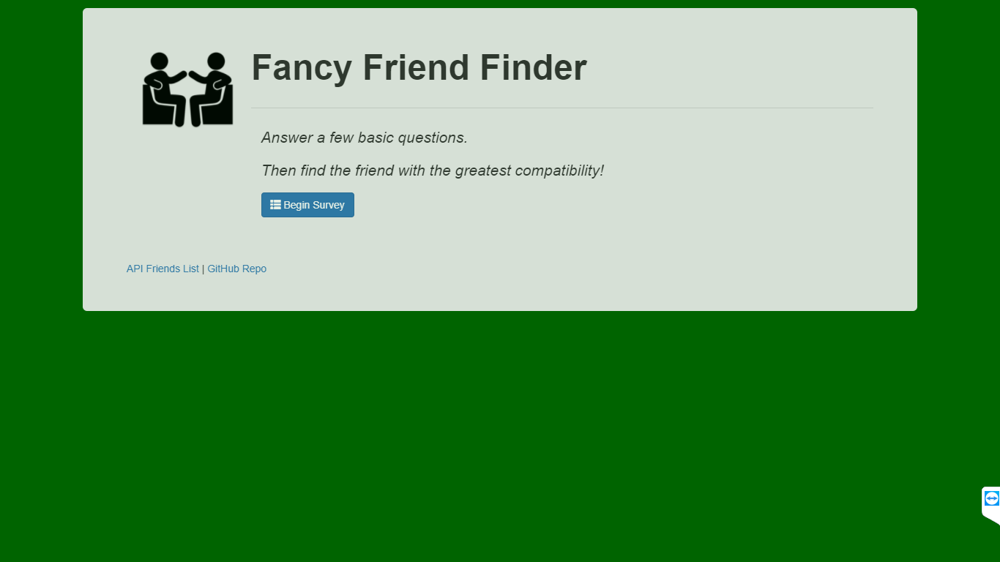
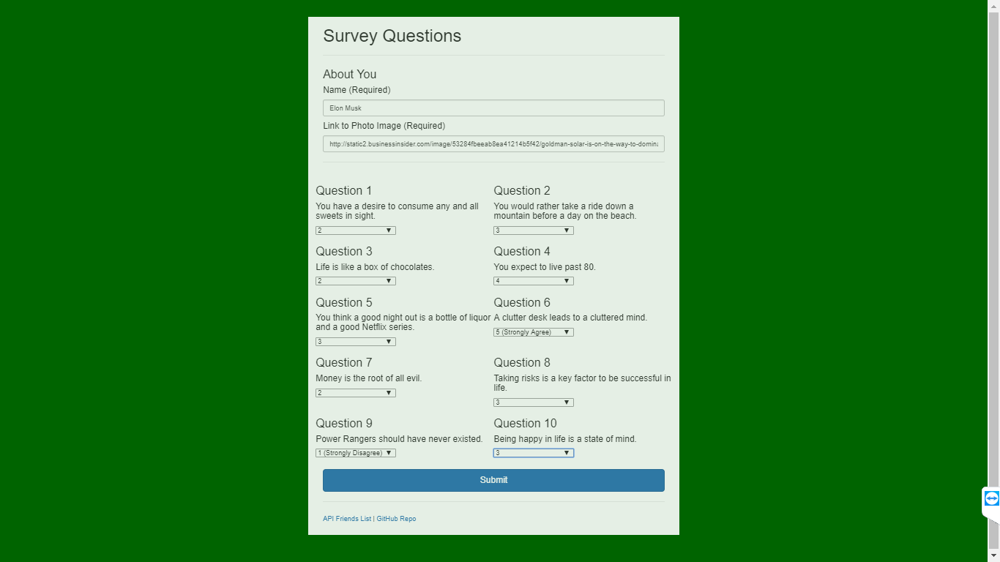
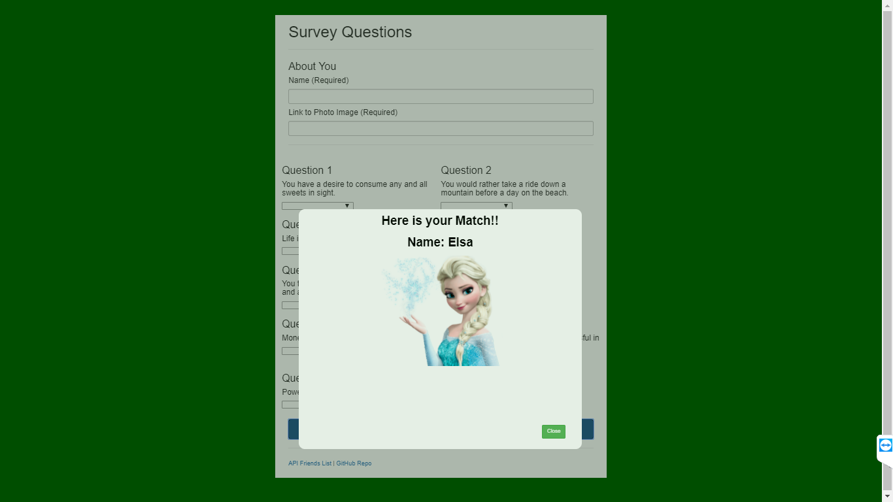
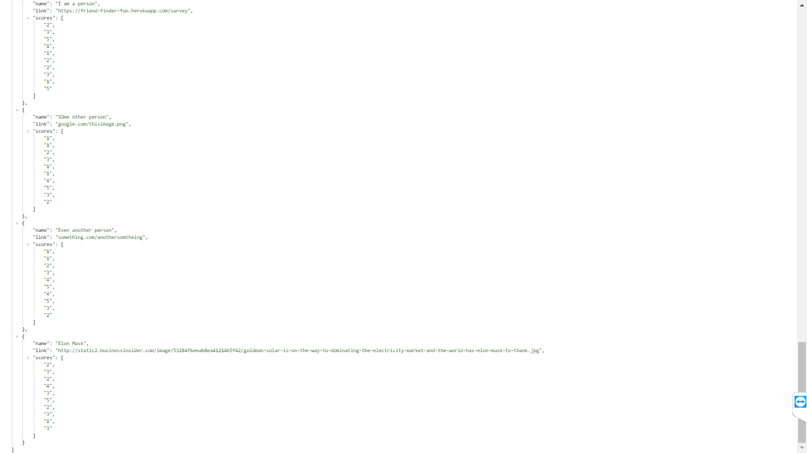

Visit Application: https://friend-finder-fun.herokuapp.com/

# FriendFinder

This is a friend finder app.  It is a node based app that is hosted on Heroku.

When you begin using the web application you are able to do two separate tasks on the landing page, view the API JSON information or begin survey.

If you click on begin survey you are able to enter your name and an image link and then answer a series of ten questions.  Each answer is given a number value indicating if you disagree or agree with the question.

Once you appropriately fill out all the fields and hit submit, the closest match to your answers will be pulled up and displayed.  At this point you are also added in to the system and can be searched at least until the connection to the server is ended.

This is a basic example of how an Express server can be set up using routing, GET & POST requests.
